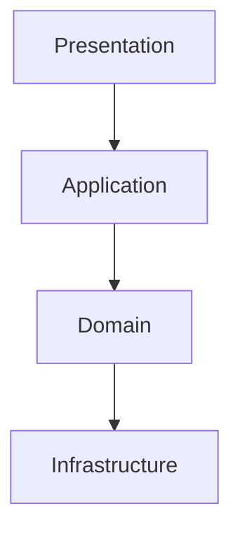

# Architecture Specification

> Generated by openlore v1.0.0 on 2026-07-26 01:44

## Purpose

This document describes the architectural patterns and structure of the system.

## Architecture Style

Layered architecture with clean separation between presentation, domain, and infrastructure layers.
The backend uses Cloudflare Workers with service-oriented decomposition, while frontend clients
(Svelte web, Flutter mobile) implement MVVM/MVP patterns with reactive state management. This
separation enables independent platform evolution, offline resilience, and testable business logic.

## Requirements

### Requirement: LayeredArchitecture

The system SHALL maintain separation between:

- Presentation (User interface rendering and user interaction handling across web and mobile platforms)
- Application (Orchestration of use cases, state management, and cross-cutting UI concerns)
- Domain (Core business logic, entity definitions, and domain-specific operations)
- Infrastructure (External communication, persistence, and platform-specific capabilities)

#### Scenario: LayerSeparation

- **GIVEN** a request from the presentation layer
- **WHEN** business logic is needed
- **THEN** the presentation layer delegates to the business layer
- **AND** direct database access from presentation is prohibited

### Requirement: SecurityModel

The system SHALL implement security via: Dual authentication scheme: cookie-based sessions for web clients and OAuth2-style access/refresh token pairs for mobile clients. Role-based access control (RBAC) with two primary roles (staff and owner) enforced at route level via requireAuth/requireOwner guards and service-level permission checks. SessionService validates tokens on each request; financial data redaction applied based on role in VisitResultTransformationService. Rate limiting enforced per IP and username via RateLimitService.

#### Scenario: AuthenticatedAccess

- **GIVEN** an unauthenticated request
- **WHEN** accessing protected resources
- **THEN** access is denied

## System Diagram

## Layer Structure

### Presentation

**Purpose**: User interface rendering and user interaction handling across web and mobile platforms
**Location**: `Svelte web pages (src/web/routes), Flutter pages (mobile/lib/presentation), UI notifiers/providers (DashboardNotifier, VisitFormNotifier, AuthNotifier), Riverpod/Provider state management`

### Application

**Purpose**: Orchestration of use cases, state management, and cross-cutting UI concerns
**Location**: `Notifiers (OutletListNotifier, ProductListNotifier, VisitDraftListNotifier), Stores (GeolocationStore, NetworkStore), Services (ToastService, NotificationService, SessionManager), Route guards (requireAuth, requireOwner)`

### Domain

**Purpose**: Core business logic, entity definitions, and domain-specific operations
**Location**: `Entity schemas (Outlet, Product, Visit, VisitDraft, ConsignmentAge), Domain services (HPPService, VisitProcessingService, VoidVisitService), Value objects (Money, Distance, Unit, Uuid), Domain exceptions (AppException, GeofenceException, ConflictException)`

### Infrastructure

**Purpose**: External communication, persistence, and platform-specific capabilities
**Location**: `API clients (ApiClient, DioClient, DashboardApiService, AuthApiService), Storage (R2 object storage, localStorage, secure device storage), Database (D1 with Drizzle ORM), Platform services (ImageCompressor, LocationService, BackgroundSyncService)`

## Data Flow

Mobile/Flutter: User action → Notifier/Provider → Repository/API Service → DioClient → Cloudflare
Worker API → Service layer → Drizzle ORM → D1 database; with offline fallback to local draft storage
and BackgroundSyncService queue. Web/Svelte: User action → Svelte store/notifier → API client →
Cloudflare Worker API → Service layer → Drizzle ORM → D1 database. Photos: Capture → ImageCompressor
(client-side) → R2 object storage; metadata persisted in D1. Sync: SyncManager/SyncStateNotifier
polls or pushes queued submissions with SyncRecord timestamps for incremental sync.

## External Integrations

| System                                                              | Purpose              |
| ------------------------------------------------------------------- | -------------------- |
| Cloudflare D1 (SQLite edge database)                                | External integration |
| Cloudflare R2 (object storage for photos)                           | External integration |
| Cloudflare Workers (serverless compute platform)                    | External integration |
| Geolocation APIs (browser Geolocation API, Flutter Geolocator)      | External integration |
| Image processing (Canvas API, Flutter image libraries)              | External integration |
| Local notifications (mobile platform APIs)                          | External integration |
| Background task scheduling (WorkManager on Android, equivalent iOS) | External integration |
| Native maps applications (geo: URI scheme)                          | External integration |
